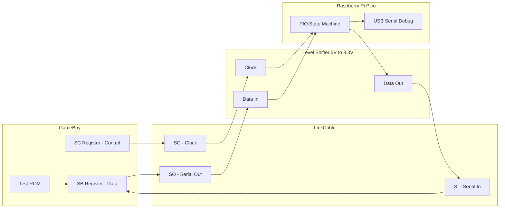

# Game Boy Link Cable ↔ Raspberry Pi Pico Communication Plan

## Overview

Establish bidirectional serial communication between a Game Boy/Game Boy Color and a Raspberry Pi Pico using the link cable protocol.

## Hardware Setup

### Cable Pinout - Assumed Mapping

Based on voltage observations from GBC running Tetris and your test ROM:

| Wire Color | Function | Voltage Observed | Description |
|------------|----------|------------------|-------------|
| **Black**  | GND      | 0V (sheath)      | Ground reference |
| **Red**    | VCC      | 5V               | Power supply from GB |
| **Brown**  | SC (Clock) | 5V idle, toggled | Serial Clock |
| **Yellow** | SO (Serial Out) | 1.4V idle, toggled | Data FROM Game Boy |
| **Orange** | SI (Serial In) | 0V floating | Data TO Game Boy |

> **Note**: Yellow at 1.4V suggests a high-impedance/floating state. The actual logic high should be ~5V during active transmission.

### Wiring to Pico with Level Shifters

The Game Boy operates at 5V logic, Pico at 3.3V. Your level shifters handle this.

**Confirmed GPIO Assignments:**

```
Game Boy Cable          Level Shifter         Pico
─────────────────────────────────────────────────────
Black  (GND)  ──────────── GND ──────────── GND
Brown  (SC)   ──────────── HV1 ─── LV1 ──── GP2 [Clock Input]
Yellow (SO)   ──────────── HV2 ─── LV2 ──── GP3 [Data Input - GB→Pico]
Orange (SI)   ──────────── HV3 ─── LV3 ──── GP4 [Data Output - Pico→GB]
Red    (VCC)  ──────────── (optional: monitor only, do NOT power from Pico)
```

| Pico Pin | Function | Direction |
|----------|----------|-----------|
| GP2 | Clock (SC) | Input |
| GP3 | Data In (SO from GB) | Input |
| GP4 | Data Out (SI to GB) | Output |

## Protocol Details

### Game Boy Serial Protocol

The GB uses an SPI-like synchronous serial protocol:

- **Bit order**: MSB first
- **Clock polarity**: Idle HIGH (CPOL=1)
- **Clock phase**: Data sampled on falling edge (CPHA=1) - equivalent to SPI Mode 3
- **Data rate**: ~8 kHz normal, ~256 kHz fast (GBC only)
- **Transfer size**: 8 bits per transaction
- **Full duplex**: Both devices send AND receive simultaneously on each transfer

### Transfer Timing

```
Clock (SC):  ─────┐   ┌───┐   ┌───┐   ┌───┐   ┌───┐   ┌───┐   ┌───┐   ┌───┐   ┌─────
                  └───┘   └───┘   └───┘   └───┘   └───┘   └───┘   └───┘   └───┘
                  
Data (SO/SI): ──< D7 >─< D6 >─< D5 >─< D4 >─< D3 >─< D2 >─< D1 >─< D0 >──────
                  bit7   bit6   bit5   bit4   bit3   bit2   bit1   bit0
```

### Master vs Secondary

- **Master**: Generates the clock signal, initiates transfer
- **Secondary**: Responds to clock, must have data ready before transfer starts
- Your test ROM runs as master (SC_REG = 0x81 enables internal clock)
- The Pico should act as secondary (respond to GB clock)

## Architecture Diagram



## Implementation Plan

### Phase 1: Pico as Secondary - Receive Only

Create Pico firmware that:
1. Monitors the clock line for falling edges
2. Samples the data line on each clock pulse
3. Assembles 8 bits into a byte
4. Outputs received bytes over USB serial for debugging

**Test with**: Your existing [`primary.c`](primary.c) ROM sending 0x00, 0xFF, 0xAA, 0x55

### Phase 2: Pico Bidirectional

Extend firmware to:
1. Queue data to send back to GB
2. Shift out data bits on each clock pulse while receiving
3. Handle the full-duplex nature of the protocol

### Phase 3: GB ROM with Receive

Modify the GB ROM to:
1. Display received bytes on screen
2. Show both TX and RX for each transaction

### Test Patterns

| Pattern | Binary | Purpose |
|---------|--------|---------|
| 0x00 | 00000000 | All zeros baseline |
| 0xFF | 11111111 | All ones baseline |
| 0xAA | 10101010 | Alternating pattern A |
| 0x55 | 01010101 | Alternating pattern B |

These patterns help verify correct bit ordering and timing.

## Pico Implementation Approaches

### Option A: Bit-Banging with GPIO Interrupts

```c
// Pseudocode
volatile uint8_t rx_byte = 0;
volatile int bit_count = 0;

void clock_falling_edge_isr() {
    int data_bit = gpio_get(DATA_IN_PIN);
    rx_byte = (rx_byte << 1) | data_bit;
    bit_count++;
    
    if (bit_count == 8) {
        // Byte complete, process it
        process_byte(rx_byte);
        bit_count = 0;
        rx_byte = 0;
    }
}
```

### Option B: PIO State Machine - Recommended

The Pico PIO can handle the timing-critical bit manipulation in hardware:

```
; PIO program pseudocode
; Wait for clock falling edge
; Read data bit
; Shift into ISR
; After 8 bits, push to FIFO
```

**Advantages of PIO**:
- Deterministic timing
- Frees CPU for other tasks
- Can handle faster clock rates

## Files to Create

| File | Purpose |
|------|---------|
| `pico/CMakeLists.txt` | Pico SDK build configuration |
| `pico/gb_link.c` | Main Pico firmware |
| `pico/gb_link.pio` | PIO state machine for serial handling |
| `secondary.c` | Updated GB ROM that can receive data |

## Verification Steps

1. Connect Pico to computer via USB
2. Open serial monitor at 115200 baud
3. Connect GB link cable to Pico via level shifters
4. Run test ROM on GB
5. Press A button - should see 0x00 on Pico serial
6. Press B button - should see 0xFF on Pico serial
7. Verify 0xAA and 0x55 patterns

## Risk Mitigation

| Risk | Mitigation |
|------|------------|
| Wrong pinout | Start with receive-only, swap wires if needed |
| Timing issues | Use PIO for precise timing |
| Level shifter direction | Verify bidirectional shifters work both ways |
| Clock polarity wrong | Try inverting clock sensing |

## Next Steps

1. **Implement Pico receive firmware** - Start with bit-banging for simplicity
2. **Test and verify pinout** - Confirm wire mapping empirically
3. **Upgrade to PIO** - Once basic communication works
4. **Add bidirectional support** - Full duplex operation
